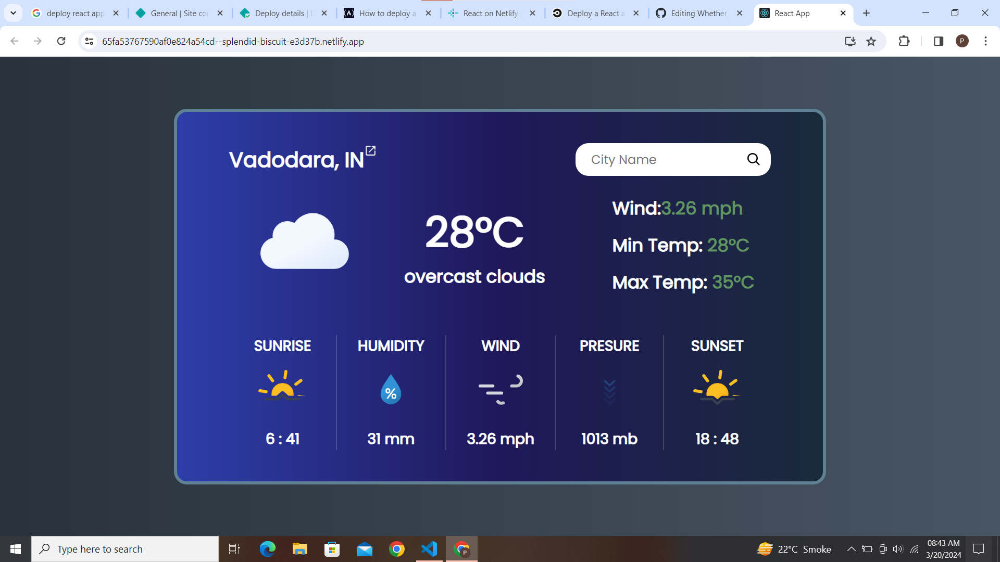

# Weather_Main

Weather_Main is a weather application built with React that provides real-time weather data using the OpenWeather API.
## Features

- View current weather conditions
- Get hourly and daily forecasts
- Search for weather by location
- Beautiful and intuitive user interface

## Demo

[View Live](https://65fa53767590af0e824a54cd--splendid-biscuit-e3d37b.netlify.app/)

## Screenshots


## Installation

1. Clone the repository:

```bash
git clone https://github.com/your_username/Weather_Main.git
```

2. Install dependencies:

```bash
npm install
```

3. Start the development server:

```bash
npm start
```

## Usage

- Enter a location in the search bar to get weather information for that location.
- Enjoy exploring the weather!

## Technologies Used

- [](https://reactjs.org/)

- [](https://openweathermap.org/)


## Contributing

Contributions are welcome! Please feel free to submit a pull request.

## License

This project is licensed under the[MIT License](https://opensource.org/licenses/MIT).

## Acknowledgements

- Weather data provided by [OpenWeather](https://openweathermap.org/)
- UI inspiration from [Dribbble](https://dribbble.com/)
